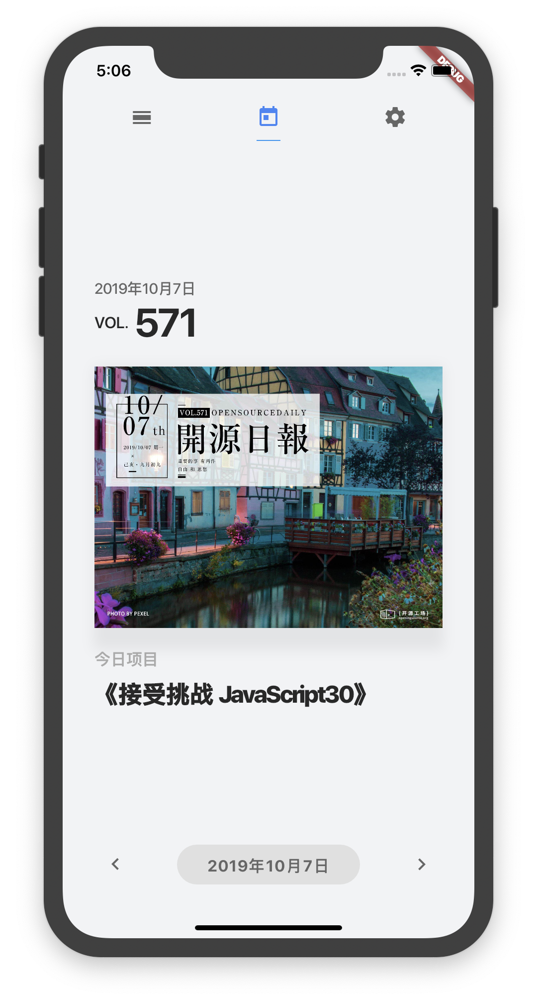
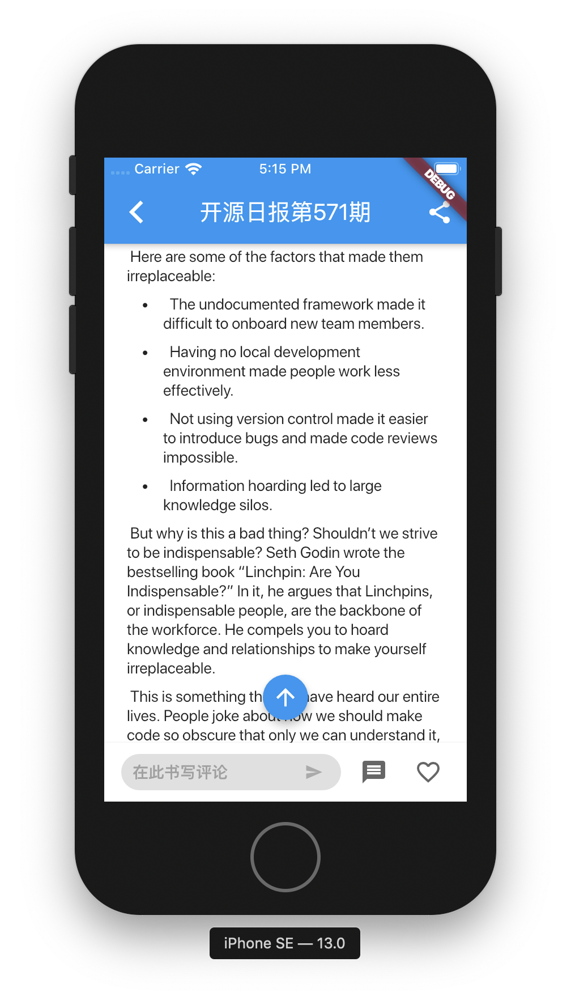

[TOC]

# openingsource_daily

开源工场-开源日报栏目 iOS 客户端

Android 客户端项目地址 -> [OpeningSourceORG/opening-source-app](https://github.com/OpeningSourceORG/opening-source-app)

# 进度

## v0.2 (20191007)

现在基本能用了，可以查看今天的日报，也可以切换日期。

## v0.1

现在只完成了最基本的功能：查看当天日报。

等哪天空闲下来了再继续写 🤣

# 截图

# 参考
- [Lab: Write your first Flutter app](https://flutter.io/docs/get-started/codelab)
- [Cookbook: Useful Flutter samples](https://flutter.io/docs/cookbook)
- [online documentation](https://flutter.io/docs)
