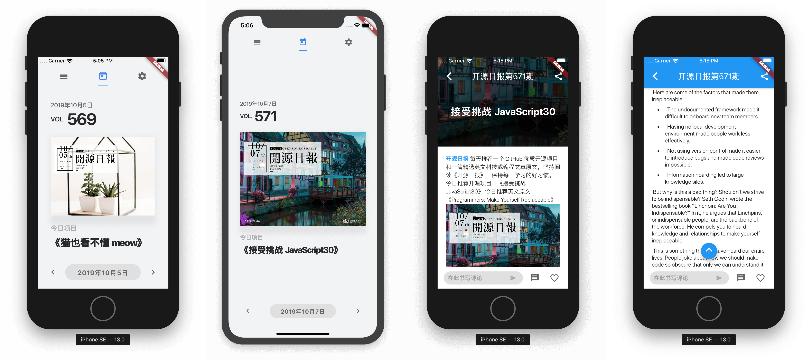

# openingsource_daily

开源工场-开源日报栏目 iOS 客户端

Android 客户端项目地址 -> [OpeningSourceORG/opening-source-app](https://github.com/OpeningSourceORG/opening-source-app)

# 进度

- 可以查看今天的日报

- 切换日期

## 待定计划

- 暗黑模式

- 完整的往期日报阅读页面和设置页面

- 修改 Markdown 显示出来的效果

- 长摁封面图可以下载封面原图

# 问题记录

- 如果碰到了gradle那些的问题。请检查用户目录下的 .gradle文件夹 中的 gradle.properties 文件，注释掉或删去其中的代理设置。

# 截图

# 参考
- [Lab: Write your first Flutter app](https://flutter.io/docs/get-started/codelab)
- [Cookbook: Useful Flutter samples](https://flutter.io/docs/cookbook)
- [online documentation](https://flutter.io/docs)
